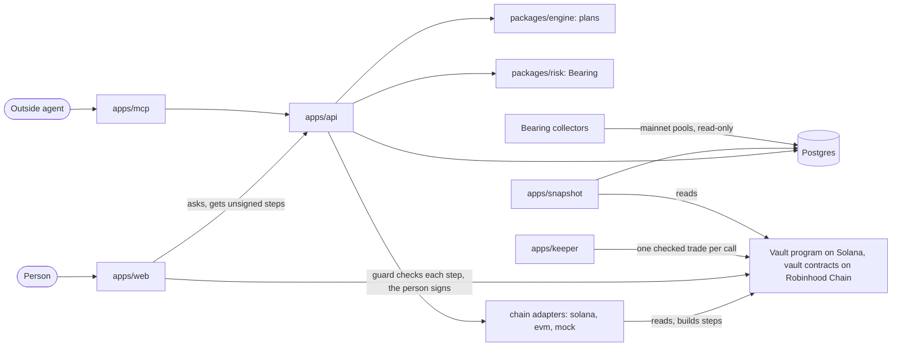

# Tenonfi

Say in a chat what your money needs to do. Tenonfi turns that goal into a plan made to measure and holds it in a vault you own, on one chain, with the exit plan measured before you deposit: what it would cost to get out at your size, and a withdrawal of the tokens themselves that needs nobody's permission. It is for a person with a specific goal for their money and no wish to assemble a portfolio by hand, and for the apps and agents that serve that person.

Built for the Colosseum Crypto World's Fair (Sep 14 to Oct 12, 2026) by Rodrigo Trindade and Thom Gabriel.

## What works today

The product runs on test networks. Nothing below is live on mainnet unless the line says so.

| What | State | Where it is recorded |
|---|---|---|
| Solana | The vault program is deployed on devnet, with 13 test tokens standing in for mainnet tokens, a test dollar and a test exchange we deployed. From the hosted app a deposit landed there and the trades after it were refused (order 771a1fad); the fix, and the full run of a plan's trades, add money and withdraw in kind, are held by tests (LiteSVM and a local validator in CI). A person's full run by hand is ledger row `OPS-7`, still todo. In a scripted check on devnet the keeper rebalanced a vault that follows a shared portfolio | [`deployments/solana-devnet.json`](deployments/solana-devnet.json), ledger rows `SOL-1` to `SOL-3`, `ADS-2`, `API-BUY-MIN`, `KEEP-1`, `API-ADD-MONEY`, `WEB-WITHDRAW`, `OPS-7` |
| Robinhood Chain | The vault contracts are deployed on the test network (chain id 46630), with 11 test tokens (seven stocks, two index funds, a gold fund and a Treasury-bill fund) and a test dollar in Uniswap v4 pools, and the hosted API serves the chain. The deposit and withdraw paths pass their tests on a copy of that network; the ledger records no end-to-end run by a person there yet | [`deployments/robinhood-testnet.json`](deployments/robinhood-testnet.json), ledger rows `EVM-1` to `EVM-3`, `TNET-2`, `WEB-RH-BUY`, `OPS-7` |
| Shared portfolios | Publish, follow and new versions, with the author limits checked by the registry on chain. A publish and a new version ran on Solana devnet; the rest is held by tests on both chains | ledger rows `API-3`, `WEB-4`, `AGT-4`, `KEEP-1` |
| Base | Off. The contracts are the same Solidity; nothing is deployed | gate `BASE`, ledger row `TNET-3` |
| The goal conversation | A model talks with the person and names assets from the chain's catalog. It sets no weight and states no figure: the weights come from one function in code (an equal split, or the shares the person stated), and the server checks every line again before a deposit | gates `RELAXED-INTAKE`, `ANY-COMPOSITION`, `DEPOSIT-STEP` |
| The plan engine | Deterministic. One goal gives three candidate plans, each line with its reason. It is reached through `POST /v1/baskets/personalize`, the MCP tool `build_plan` and `pnpm plan:try`; the chat on `/goal` does not use it to pick holdings | `packages/engine`, gates `SOLVER`, `THREE-PLANS`, `ANY-COMPOSITION` |
| Bearing | Real reads. It measures what a sale costs, by size, from pools on Solana mainnet and Robinhood Chain mainnet, read-only | `packages/risk`, `scripts/risk-evm`, [`docs/risk/STATE-RISK.md`](docs/risk/STATE-RISK.md), ledger rows `REVM-1`, `RISK-5` |
| Figures on a test network | Read from the test network and labelled "test network" (`"provenance": "sandbox"`). A stand-in token borrows the measured exit depth and the yield of the mainnet token it models, under the same label | gate `ENG-DEVNET-EXIT-TWIN`, ledger rows `ENG-DEVNET-EXIT`, `ENG-DEVNET-YIELD` |
| Sample figures | Anything run on the in-memory chain (`packages/chain-mock`, the default of a local run) is labelled "Sample figures" (`"provenance": "mock"`) | gate `MOCK-QUIET` |
| Sign-in | A passkey wallet or the person's own wallet, through Privy | ledger rows `WAL-1`, `WAL-2` |
| Portfolio | Each vault read from its chain, with drift from its targets and a status of "On track", "Watch" or "Off track" | ledger rows `PORT-1` to `PORT-4`, gate `ON-TRACK-V1` |
| Agents | An HTTP API with an OpenAPI document, an SDK, an MCP server with seven tools and a skill file. An agent proposes; the person opens a link, reviews and signs | [`apps/mcp/README.md`](apps/mcp/README.md), [`skills/tenonfi/SKILL.md`](skills/tenonfi/SKILL.md), gates `AGENT-LINK`, `MCP-TOOLS` |
| Mainnet | One thing ran there: on Sep 30 the first version of the engine ran on Solana from a demo wallet, at small size: swaps, a lending deposit, and a rebalance signed by an agent key held on the server. The server-signing route is now switched off (`LEGACY_STRUCTURER`) | signatures in [`docs/structurer/STATE.md`](docs/structurer/STATE.md), rows D2-AM to D6-PM |

The ledger marks most build rows `in-review` even where the pull request has merged; the deployment records and the code are the firmer source.

## Try it

Hosted, on the test networks: <https://www.tenonfi.xyz>, with the API at <https://tenonfi-api.onrender.com> (`/docs` for the OpenAPI pages, `/v1/config` for the chains and flags it runs with). The API host sleeps when idle, so the first request can be slow. Sign in with a passkey and say a goal. Where the test faucet is configured, the deposit step offers "Get test funds" for the test dollars and gas it needs.

Locally, on the in-memory chain with sample figures. Node 22 or later, pnpm 11 and Docker:

```sh
cp .env.example .env     # one file at the repo root serves every app and script
pnpm install
pnpm db:up               # Postgres 16 in Docker on port 5433, then the migrations
pnpm db:seed             # the asset registry rows
pnpm feeds:refresh       # yield and FX observations; the plan routes need them
pnpm feeds:refresh-models  # yields of the tokens the test networks' stand-ins model; after db:seed
pnpm dev                 # API on :3001 (/docs), web on :3000
```

The API does not start without the database. `.env.example` names every variable and says what each does; the ones that change what a local run can do:

- `DATABASE_URL`: the default matches `docker-compose.yml`.
- `PRIVY_APP_ID`: commented out in `.env.example`. Set it to the same id as `NEXT_PUBLIC_PRIVY_APP_ID`, which the file already carries. Without it the API has nobody to trust, and the goal chat, orders and the portfolio answer 503.
- `NEXT_PUBLIC_WALLET_DRIVER=test`: a throwaway wallet in the browser for work on screens. It carries no sign-in, so it does not reach those routes either.
- `ANTHROPIC_API_KEY`: needed for the goal chat to answer. Without it only the guided intake works, reading a goal with the rules parser alone and saying so.
- `CHAIN_MODE_<CHAIN>` and `CHAIN_NETWORK_<CHAIN>`: unset means the in-memory chain, and `testnet` when a chain is live, so nothing reaches mainnet by omission.
- `SOLANA_RPC_URL`: the routes that read Solana.

To run a checkout against Solana devnet with a real passkey wallet: [`docs/vault/RUN-DEVNET-LOCAL.md`](docs/vault/RUN-DEVNET-LOCAL.md).

## Architecture



The API builds transactions and never signs for a person. The browser holds the guard (`packages/sdk`), which reads a transaction's bytes and refuses anything that is not the step the person approved. The vault enforces its own rules on chain: only the owner deposits or withdraws, and a keeper trade must stay inside the plan's assets, near a reference price and under a weekly loss limit.

| Folder | What is in it |
|---|---|
| `apps/api` | Fastify and zod, served as OpenAPI at `/docs` |
| `apps/web` | The app, Next.js |
| `apps/risk-api` | The `/risk/*` routes on their own |
| `apps/keeper` | The service that rebalances a vault with auto-follow on, one checked trade at a time |
| `apps/snapshot` | The worker that reads every known vault every ten minutes and keeps what it read. It holds no key |
| `apps/mcp` | The MCP server for outside agents. It never signs |
| `packages/schemas` | zod types shared everywhere, and the disclaimer |
| `packages/engine` | Parser, asset registry, solver, schedule, risk sheet |
| `packages/risk` | Bearing: pool decoders, exit-cost curves, the liquidity provider |
| `packages/basket` | The chain-free logic of a plan in a vault: limits, drift, the rebalance planner, the weights of a person's picks |
| `packages/sdk` | The guard and the order executor the web and outside agents share |
| `packages/chain-solana`, `packages/chain-evm`, `packages/chain-mock` | One `ChainAdapter` each. The mock is a chain in memory, stamped `mock` |
| `packages/db` | Drizzle schema and migrations (Postgres) |
| `programs/` | The Solana programs (Anchor), with interface files in `idl/` |
| `contracts/` | The EVM contracts (Foundry) |
| `deployments/` | What is deployed where, one file per network |
| `scripts/` | Checks, test-network operations, the collectors. `scripts/mainnet` is the live sender, and a person runs it, never an agent |
| `spikes/`, `try/` | The two early vault test rigs; the plan playground (`pnpm plan:try`) |
| `content/`, `fixtures/` | Risk sheets, theme lists and stock attributes; frozen inputs for tests |
| `docs/` | Specs, decisions and the ledger, indexed in [`docs/README.md`](docs/README.md) |
| `.design/` | The design system |

Who may import whom is a table in [`docs/vault/DESIGN-VAULT.md`](docs/vault/DESIGN-VAULT.md), section 2, and `tests/boundaries.test.ts` fails on anything else.

## Deployed addresses

Test networks only. Every address is from the two files under `deployments/`.

Solana devnet:

| What | Address |
|---|---|
| Vault program | [`529j92ASeopFHuLLueGdyaUy4BsZ7UWqrgoVWn2iK1QW`](https://solscan.io/account/529j92ASeopFHuLLueGdyaUy4BsZ7UWqrgoVWn2iK1QW?cluster=devnet) |
| Test exchange and test prices (not part of the product) | [`2ticePjZZ6e34bNUgUXz7v3uHm3jS8jvV13gesdvKn4f`](https://solscan.io/account/2ticePjZZ6e34bNUgUXz7v3uHm3jS8jvV13gesdvKn4f?cluster=devnet) |
| Test dollar (tUSDC) | [`AEtFZt8Fq4PYzBs4d8VoMypDDhjp9XTv6qvhJZhd8BUn`](https://solscan.io/account/AEtFZt8Fq4PYzBs4d8VoMypDDhjp9XTv6qvhJZhd8BUn?cluster=devnet) |

Robinhood Chain test network (46630):

| What | Address |
|---|---|
| Vault factory | [`0xa3309dc51b41e55fcd48b12377025cd2ba4d21a4`](https://explorer.testnet.chain.robinhood.com/address/0xa3309dc51b41e55fcd48b12377025cd2ba4d21a4) |
| Shared-portfolio registry | [`0xe73c5df15452469873f610a26dac7fec68a23b14`](https://explorer.testnet.chain.robinhood.com/address/0xe73c5df15452469873f610a26dac7fec68a23b14) |
| Vault beacon | [`0x4c6699623966be46a40844da3e79d7da3d8d3d96`](https://explorer.testnet.chain.robinhood.com/address/0x4c6699623966be46a40844da3e79d7da3d8d3d96) |
| Test dollar (tUSDG) | [`0xd3d6e7bf284d922651983468b75492be4f3f689a`](https://explorer.testnet.chain.robinhood.com/address/0xd3d6e7bf284d922651983468b75492be4f3f689a) |

The test tokens, the roles and the parameters are in the same files.

## How it is verified

- `pnpm verify`: lint, both typechecks, the tests and the build. CI runs the same command on every pull request, against Postgres 16 (`.github/workflows/ci.yml`), and a second job runs the app in a browser with Playwright and axe.
- `pnpm test:program`: builds the Solana programs and runs their tests in LiteSVM. It needs Anchor and the Solana CLI ([`programs/README.md`](programs/README.md)). `program.yml` runs it when those files change, with the money path on a local validator.
- `pnpm test:contracts`: `forge test` in `contracts/`. It needs Foundry. `contracts.yml` runs it when those files change.
- `security.yml`, on every pull request and weekly: gitleaks, `pnpm audit --prod` and cargo-deny. The advisories accepted for now are in [`docs/vault/SECURITY-DEPS.md`](docs/vault/SECURITY-DEPS.md).
- Every task has a row with its evidence in [`docs/vault/STATE-VAULT.md`](docs/vault/STATE-VAULT.md), and every decision a row in [`docs/GATES.md`](docs/GATES.md).

## Not done, and known limits

- No mainnet deployment. The stock tokens, Jupiter's liquidity and the price feeds do not exist on test networks, so test tokens, a test exchange and copied prices stand in for them. The handling of the real ones is tested on copies of mainnet (gates `SHOW`, `SPEND`).
- The vault program and the contracts are unaudited, and the team holds the upgrade key on each chain. The app says so before a first deposit (`TRUST_STATUS` in `packages/schemas`).
- The keeper and auto-follow are built and tested but switched off on the hosted API (`KEEPER_ENABLED`, `AUTO_FOLLOW_<CHAIN>`). Rebalancing there is the person's own press.
- No estimate of the odds of reaching a goal. A plan shows a status with its method and date, never a probability (ledger row `ENG-1`).
- Plans are in US dollars, and the app is English only (gates `USD-ONLY`, `ENGLISH-ONLY`).
- The security rows `SEC-1` to `SEC-4` are open: the check of each deployment's authorities against `deployments/*.json`, the hostile-case matrix, the invariant and fuzz runs, and the dependency overrides.
- Branch protection on `main` and `staging` is not set (ledger row `ORG-5`).
- The MCP server has not been checked against the hosted API (ledger row `AGT-3`).
- The product is not for people in the United States. The notice before a first deposit says so; there is no location block. Stock tokens can also be paused or frozen by their issuers.

## Disclaimer

This tool is not licensed investment advice. It structures and explains an allocation from a goal you state; the decision and custody are yours. The distributor embedding this tool holds the client relationship.

## Team

Rodrigo Trindade: the plan engine, Bearing and the design system. Thom Gabriel: the vault program and contracts, the API and the app. Work that existed before the hackathon window is disclosed in [`docs/PRIOR-WORK.md`](docs/PRIOR-WORK.md). How work moves here, for people and for Claude sessions alike, is in [`CLAUDE.md`](CLAUDE.md).

## Licence

Apache-2.0. See [`LICENSE`](LICENSE).
